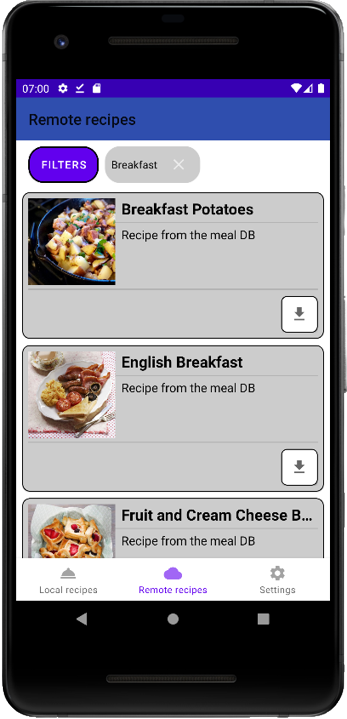
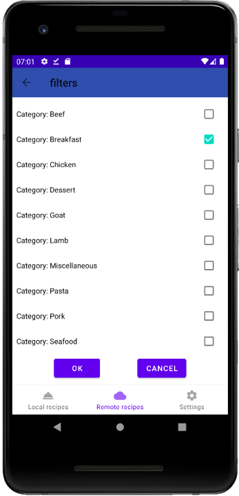
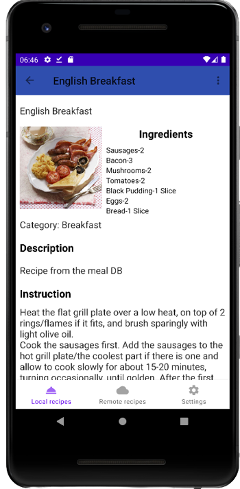
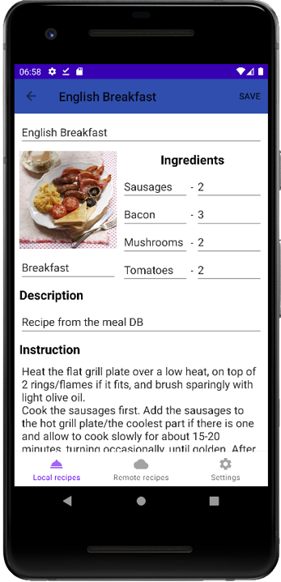
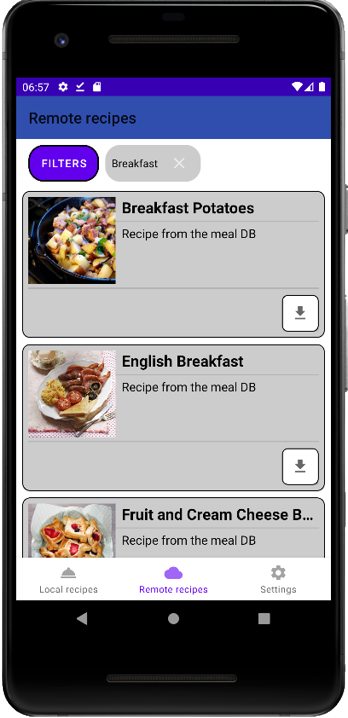
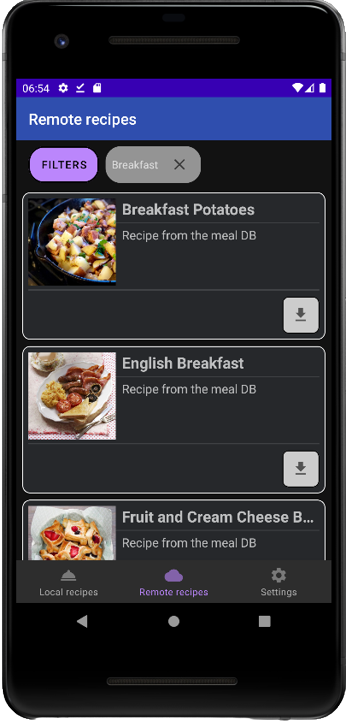

<h1 align="center">Cooking Recipes</h1>

Cooking Recipes is an application for creating and saving recipes on your mobile phone. 
Also this application allows you to view and download some ready-made recipes from the website www.themealdb.com.  
This app supports 2 themes: Light and night. And also 2 languages: English and russian.

## Screens

Recipes list | Filter selection | View recipe | Edit recipe
:-------------------------:|:-------------------------:|:-------------------------:|:-------------------------:
 |  |  | 

## Themes

Light | Night
:-------------------------:|:-------------------------:
 | 

## Technology stack
- Language - Kotlin
- Platform - Android  
- App architecture - MVVM  
- Database - Room  
- Saving data - Data store
- Network - Retrofit  
- Multithreading - Coroutines  
- Asynchrony - Flow  
- Navigation - Navigation architecture component  
- Load images - Coil  
- DI - Dagger 2  